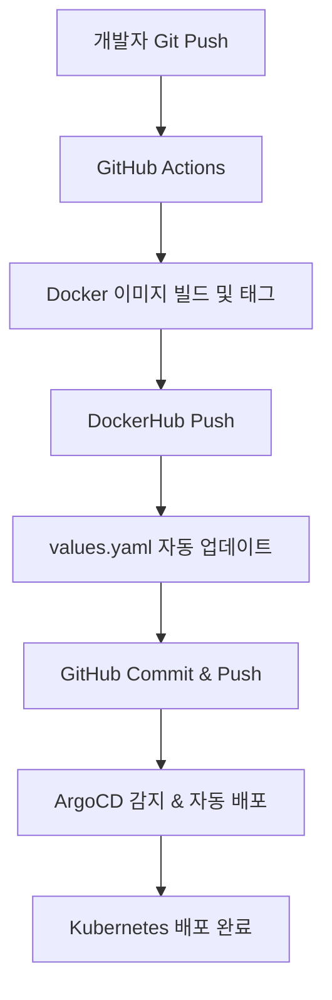

# DevOps_Mini_1

ArgoCD + GitHub Actions 기반 GitOps 스타일의 자동화된 CI/CD 파이프라인 구축 프로젝트입니다.  
Helm Chart, Prometheus/Grafana 모니터링, Auto Rollback, 이미지 자동 태깅까지 적용된 **실전형 DevOps 미니 프로젝트**입니다.

---

## 🚀 프로젝트 구성

### ⚙️ 기술 스택

- Kubernetes (k8s)
- Helm Chart
- ArgoCD (GitOps 기반 CD)
- GitHub Actions (CI)
- Docker & DockerHub
- Prometheus + Grafana (모니터링)
- yq (YAML 자동 수정)

---
## 🧪 CI/CD 파이프라인 흐름



## ✅ 주요 기능
🔁 GitHub Actions → Docker 이미지 빌드 + 태그 자동화

✍️ yq → values.yaml의 image.tag 자동 삽입

🔄 GitHub Commit & Push → ArgoCD가 자동 Sync

💡 Prometheus + Grafana 모니터링 (dev/staging/prod)

🛡️ ArgoCD Auto Rollback / Retry 기능

🔧 DockerHub 권한 + GitHub Secrets 적용

🐛 index.html 한글 깨짐, 이미지 tag 중복 문제 해결 (실무 이슈 경험 기록)

## 🧠 배운 점
GitOps 구조에서 latest 태그 사용의 위험성

CI에서 values.yaml 자동 반영의 중요성

git pull --rebase 습관화의 필요성

GitHub Actions의 권한 설정 (push 문제, secrets, write access 등)

실전에서 겪는 DevOps 실무 이슈 경험

## 📝 실행 방법 (로컬 테스트)
```
git clone https://github.com/namduhus/DevOps_Mini_1.git
cd DevOps_Mini_1

kubectl apply -f nginx-chart/application-dev.yaml -n argocd
kubectl apply -f nginx-chart/application-staging.yaml -n argocd
kubectl apply -f nginx-chart/application-prod.yaml -n argocd


kubectl get all -n dev
kubectl get all -n staging
kubectl get all -n prod


```

